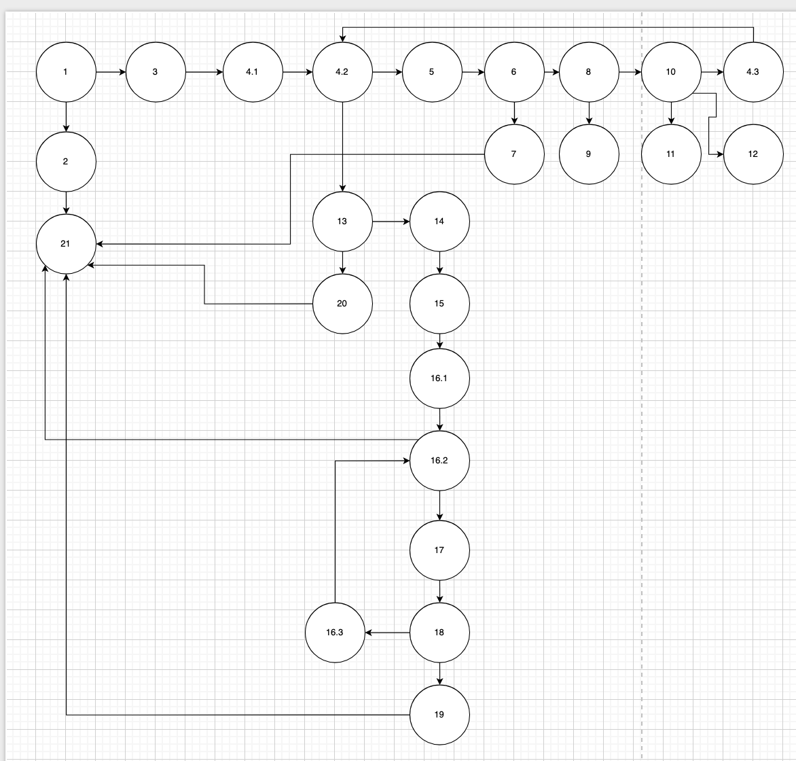

# Втора лабораториска вежба по Софтверско инженерство

## Махмут Мифтароски, бр. на индекс 232055

### Control Flow Graph

Фотографија од control flow graph-ot:


### Цикломатска комплексност

Цикломатската комплексност на функцијата `checkCart` изнесува **9**. Истата е пресметана со помош на формулата:

> **V(G) = P + 1**,
> каде што **P** е бројот на предикатни јазли во кодот.

Во овој случај, бројот на предикатни јазли е **8**, и тоа:

```java
if (allItems == null)

for (int i = 0; i < allItems.size(); i++)

if (item.getName() == null || item.getName().length() == 0)

if (item.getPrice() > 300 || item.getDiscount() > 0 || item.getQuantity() > 10)

if (item.getDiscount() > 0)

if (cardNumber != null && cardNumber.length() == 16)

for (int j = 0; j < cardNumber.length(); j++)

if (allowed.indexOf(c) == -1)
```

Согласно формулата:

> V(G) = 8 + 1 = 9

## Тест случаи според критериумот Every Statement

За Every Statement потребно е секоја наредба во кодот да се изврши барем еднаш.
Минимален број на тест случаи ќе биде 6.

### Прв тест случај

```java
List<Item> items = List.of();
double result = SILab2.checkCart(items, "1234567890123456");
assertEquals(0.0, result);
```

Тестира што ќе се случи ако листата на артикли е празна.
Очекуваме дека резултатот ќе биде 0.0.

### Втор тест случај

```java
List<Item> items = List.of(new Item("coconut", 1, 100, 0.0));
double result = SILab2.checkCart(items, "1234567890123456");
assertEquals(100, result);
```

Тестира дали се пресметува правилно цената за еден артикл со количина 1 и цена 100, без попуст.
Очекуваме резултатот да биде 100.

### Трет тест случај

```java
List<Item> items = List.of(new Item("coconut", 1, 300, 0.0));
double result = SILab2.checkCart(items, "1234567890123456");
assertEquals(300.0, result);
```

Слично како претходниот, но со повисока цена.
Тестира дали пресметката ja зема правилно цената без попуст.

### Четврти тест случај

```java
List<Item> items = List.of(new Item("coconut", 2, 200, 0.1));
double result = SILab2.checkCart(items, "1234567890123456");
assertEquals(330.0, result);
```
Тестира дали попустот се применува правилно.
Цена без попуст би била 2 * 200 = 400.
Со 10% попуст, се намалува за 40, значи треба да биде 360. Но, артикалот ако има поголема цена од 300 или било каков попуст или количина поголема од 10 се одзема 30.
така да 360-30 резултатот е 330.

### Петти тест случај

```java
List<Item> items = List.of(new Item("coconut", 1, 100, 0.0));
double result = SILab2.checkCart(items, "1234567890123456");
assertEquals(100.0, result);
```
Тестира дали кога нема попуст (0.0), цената останува иста.

### Шести тест случај

```java
 List<Item> items = List.of(new Item("coconut", 1, 100, 0.0));
RuntimeException error = assertThrows(RuntimeException.class, ()->{
    SILab2.checkCart(items,"1234а567890123456");
});
assertEquals("Invalid card number!", error.getMessage());
```
Картичката содржи недозволен знак ('a').
Ќе се фрли RuntimeException со порака: "Invalid character in card number!"

## Тест случаи според Multiple Condition критериумот

За Multiple Condition ни се потребни минимум 4 тест случаи каде што се опфатени сите комбинации на вистинитост на условите, со цел да се провери логиката на изразот:

Логичкиот израз е:  
`F || F || F` (сите услови се false) -> Ова треба да падне (false)  
`F || F || T` (последниот услов е true) -> Ова треба да помине (true)  
`F || T || F` (вториот услов е true) -> Ова треба да помине (true), без разлика дали последниот е true или false  
`T || X || Y` (првиот услов е true) -> Ова треба да помине (true), без разлика на останатите услови (X и Y можат да бидат true или false)

### Примери на тест случаи

| Тест случај | Услов 1 | Услов 2 | Услов 3 | Очекуван резултат |
| ----------- | ------- | ------- | ------- | ----------------- |
| 1           | False   | False   | False   | False (падне)     |
| 2           | False   | False   | True    | True (помине)     |
| 3           | False   | True    | False   | True (помине)     |
| 4           | True    | False   | False   | True (помине)     |

Оваа табела ги покрива сите основни комбинации според Multiple Condition критериумот за изразот услов1 || услов2 || услов3.

## Објаснување на unit тестовите

Во Every Statement тест случаите прво имаме анотација `@Test` која означува дека методот е тест.

За секој тест случај, во функцијата:

* Правиме листа и ставаме податоци кои сакаме да ги тестираме.
* Со променливата result го зачувуваме резултатот што би го добиле ако апликацијата се изврши со тие податоци.
* Потоа во assertEquals(x, result) проверуваме дали резултатот од методот е точен, односно дали result е еднаков на очекуваната вредност x.

Исто така, во Multiple Condition тест случаите, исто така правиме листа и ставаме различни податоци кои сакаме да ги тестираме. Со променливата result ја земаме вредноста што ја враќа методот за тие податоци, и ја споредуваме со точниот очекуван резултат со assertEquals(x, result).

Со ова се проверува дали методот работи правилно за различни влезни ситуации.


